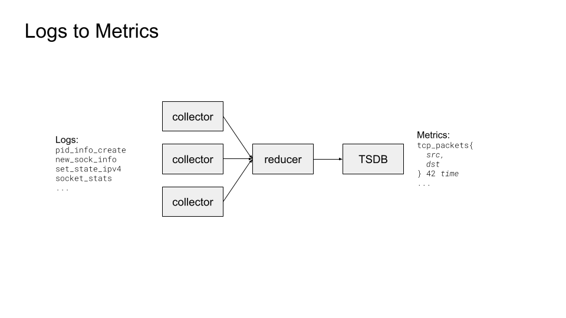
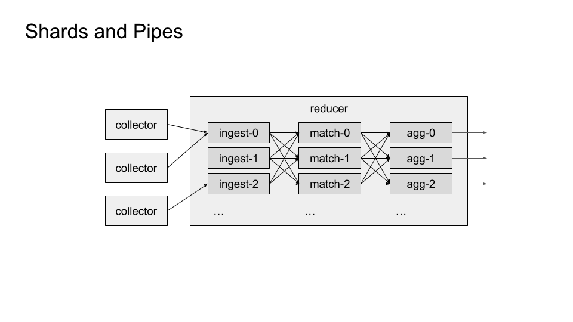
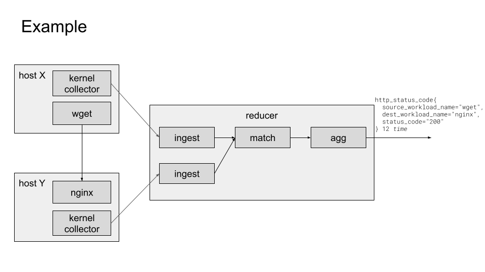
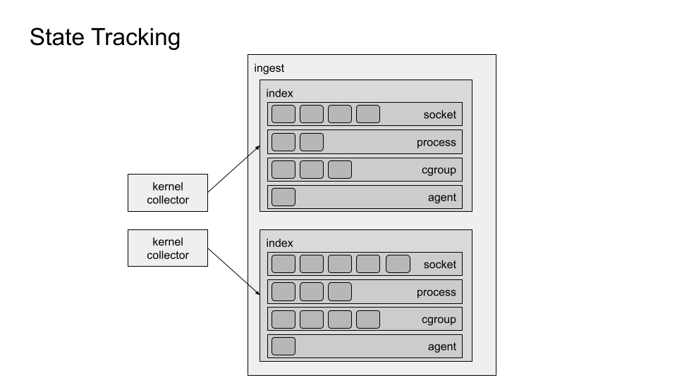
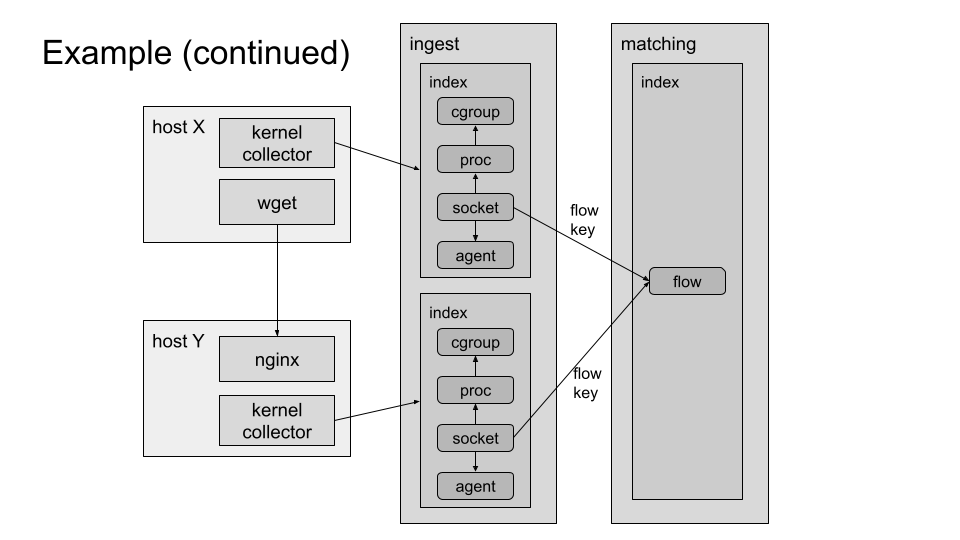
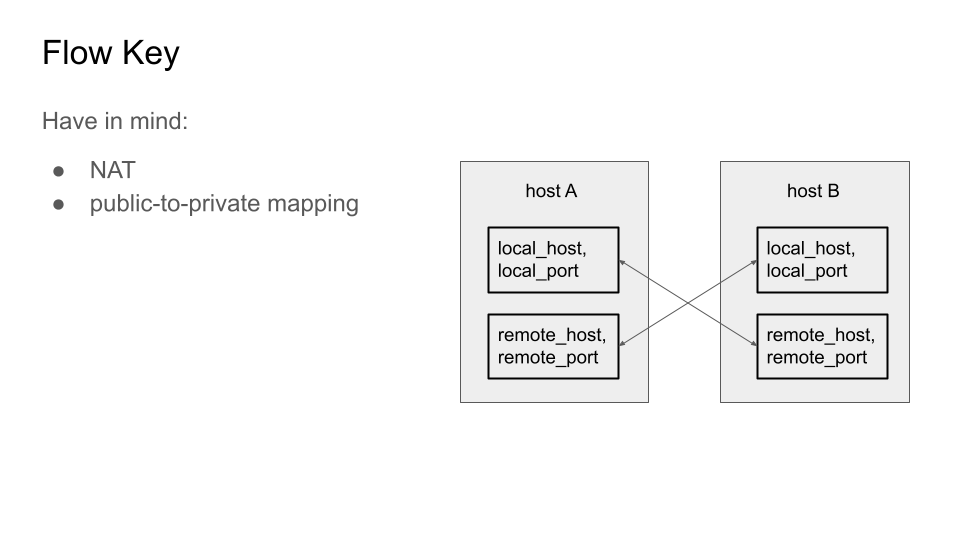
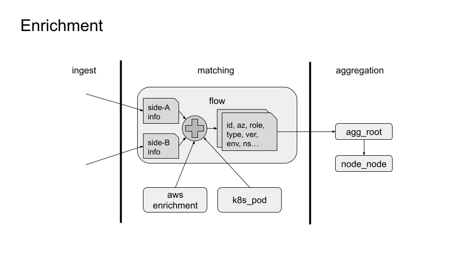
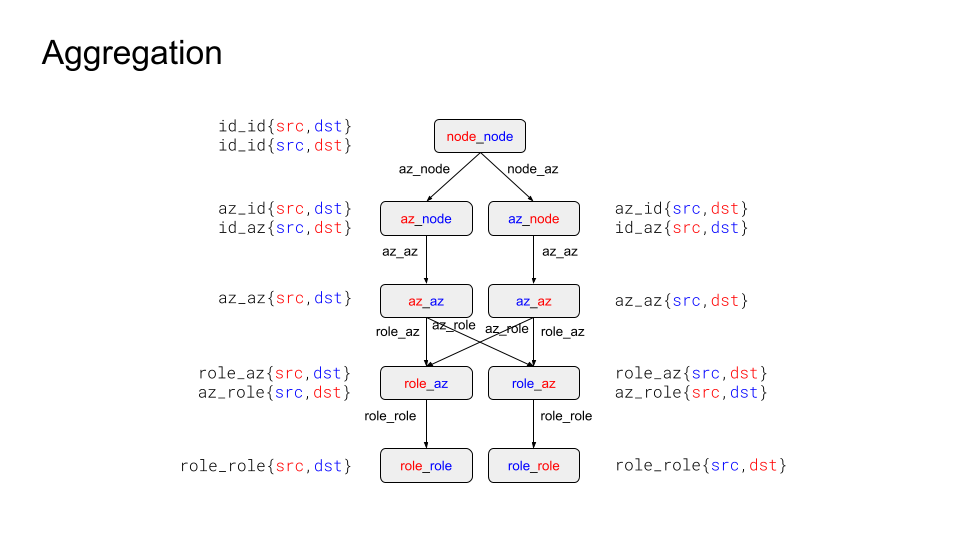
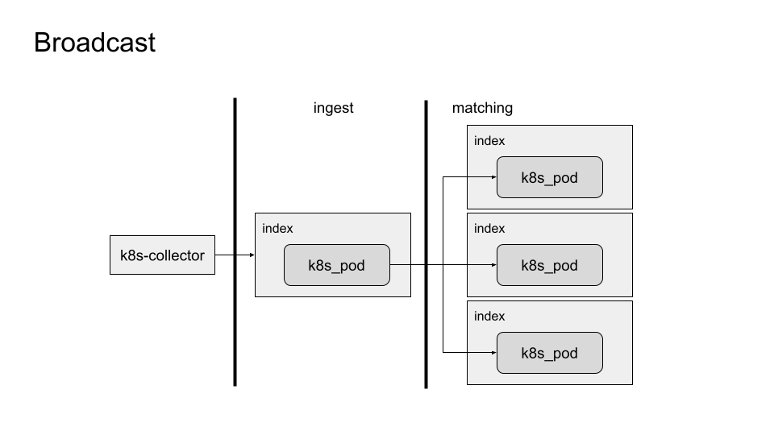
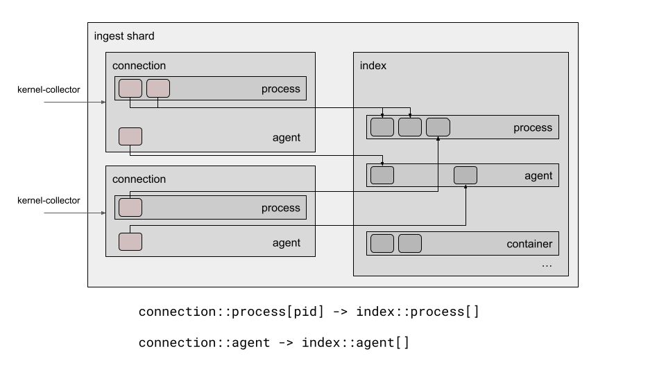

# Reducer Architecture Overview #

## Logs to Metrics ##

The job of the Reducer is to reduce logs coming in from multiple collectors into
one stream of metrics.




## Shards and Pipes ##

The Reducer is split into three stages of data processing – ingest, matching and
aggregation -- with each stage running one or more shards. Shards are connected
one-way, and communicate using message passing, using the same message encoding
as is used between collectors and the reducer.

Each shard is running one thread of execution, and there is no data-sharing
between shards (in theory -- in practice this is not strictly true, as ingest
shards share one load balancer and one private-to-public IP address map).
This architecture provides scalability without the usual headaches that come
with multithreading.




## Example ##

In this example one collector each is observing on part of a HTTP connection.
Log messages are sent from collectors and are received into ingest shards,
same one or different ones – it does not matter. Both the metadata (enrichment
information) and metrics (numbers) from both sides are joined at one place in
one of the matching shards. From there it is sent to one of the aggregation
shards where it is aggregated and written out in the form of metric samples.




## State Tracking ##

Ingest shards do not just ingest; their main task is to keep track of all the
entities that collector is reporting on. Entities such as TCP and UDP sockets,
processes, cgroups. We can call this activity _state mirroring_ or
_state tracking_, and we call these entities _spans_. As log messages are
ingested, spans are created and deleted as those resources on the system being
observed are created and destroyed. Some log messages signal a change in state
of a particular resource (e.g. "a socket is bound to an IP address").




## Example (continued) ##

The most interesting resources that we track are TCP and UDP sockets. Sockets
contain the lowest level of metadata that we use, and also provide metrics that
are ultimately the information around which everything else revolves
(bytes sent/received, TCP resets, drops, etc.) By the time we get a log message
on socket's metrics, we will also know the additional relationships between this
socket and other spans – process, cgroup – and from those we can extract
additional enrichment metadata.

A _flow_ is something like a network connection – but we associate flows even
with connectionless protocols. A flow will contain information about both sides
of the connection.

Enrichment metadata and metrics from both sockets are joined in one flow span.
For this to happen, both sockets need to come up with the same identifier that
identifies a flow. We call this the _flow key_.




## Flow Key ##

```
flow_key :=
	if ((local_host, local_port) < (remote_host, remote_port))
	then (local_host, local_port, remote_host, remote_port)
	else (remote_host, remote_port, local_host, local_port)

local_host, remote_host : IPv6Address

local_port, remote_port : u16
```

What both sockets have in common is the local/remote host/port four-tuple. This
is how the flow key is derived. There might be address translations between what
one side of the connection sees and what the other side sees. It is important
that we track this and that we come up with the same set of addresses and ports
on both ends. Otherwise, instead of one fully-enriched flow we end up with two
partially-enriched flows.




## Enrichment ##

Inside the flow span, enrichment information from both sides is then used to
derive the _node keys_ for both sides of the flow. What is meant by this is that
the (id, az, role, type, env, ...) n-tuple uniquely identifies a _node_, i.e. it
constructs a _node key_. There will be two node keys for two nodes, and this is
where the aggregation tree starts.

In this example two additional span types are used in deriving the node keys --
one for AWS and one for Kubernetes. These spans came to existence here through
the _broadcast_ mechanism (explained later).




## Aggregation ##

Keys for _az_ and _role_ spans are subsets of the key for node spans. Each
element of an aggregation tree derives the key for its sub-elements from its own
key. Individual aggregation trees can share elements (spans). Each element
(span) contains a metric store (or two) for each supported protocol. We output
metrics by visiting every element of all aggregation trees, and writing out
metrics values from the metric store of each span. We use _(role,role)_ keys as
sharding keys for sharding across aggregation shards. If two aggregation trees
have the same _(role,role)_ values, then _role_role_ elements will be shared
between them and possible other elements as well. If they don't have the same
_(role,role)_ values, then those two aggregation trees will not touch, and they
can be contained in separate aggregation shards.




## Broadcast ##

Earlier we saw two additional span types that were used in deriving full node
keys – _aws_enrichment_ and _k8s_pod_. These two are instantiated by Cloud and
Kubernetes collectors, respectively.

But that happens in the ingest stage – how do they materialize in the matching
stage? Answer: proxy spans (covered later). When a message from the
k8s-collector instantiates a k8s_pod span in the ingest stage, it is a proxy for
k8s_pod in the matching stage. Targets of proxies can be either sharded across
target shards, or can be broadcast to all target shards, as is the case here.

We use this kind of broadcasting to relay information that needs to be made
available to all downstream shards. Since we don't share information by
reference, we need to share it by copy.




## Connections and Index ##

A _connection_ object is instantiated for every client connection.

A client will normally be a collector, but a connection is instantiated when
anything connects to the reducer.

A connection object will keep a mapping from a client-specified reference to a
handle that points to a span instance inside the corresponding span pool
(see the [Referenced Instances](../render.md#referenced-instances) section of
the _Render Framework_ documentation).

For singleton span types, it keeps a single handle to a span in the pool.
So "singleton" means it is a singleton per connection, it does not mean a
singleton per shard or per application.

The index object will contain a container for each span type, not only for those
spans which are accessed externally – from clients, either as singleton or via
the _ref_ message field. Those containers will be hashmaps for indexed span
types or pools for non-indexed span types. This is unrelated to the _ref_ field
in a message


